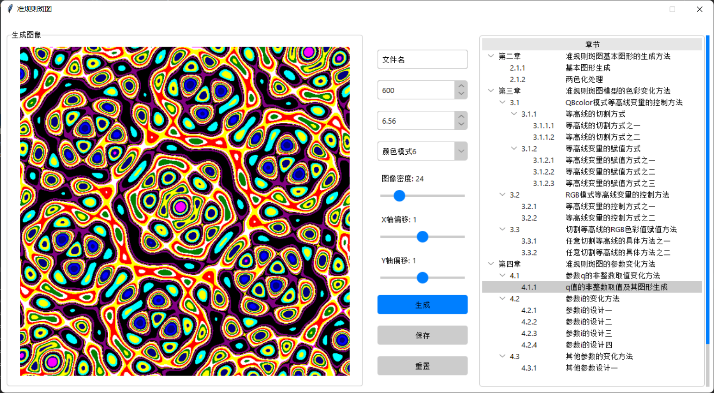

# QuasiRegularPatternV3.0

#### 使用说明
1.  参数调整区域
-  文件名输入框：输入保存图片时的文件名
-  图像大小：图像分辨率
-  迭代次数：模型计算时迭代的次数
-  颜色模式：可以选择不同的色带，得到不同的配色效果
-  图像密度：对图像进行缩放
-  X/Y轴偏移：图像进行水平和竖直方向的平移
2.  章节选择区域
-  可以在 TreeView 中选择不同章节，即不同的模型和变化方式
3.  按钮区域
-  生成按钮：确定参数和模型后可以点击生成图像
-  保存按钮：根据文件名在根目录的 images/save 文件夹中生成对应的 png 文件
-  重置按钮：对部分参数进行重置（图像大小：600，迭代次数：3，图像密度：12，X/Y轴偏移：1）

